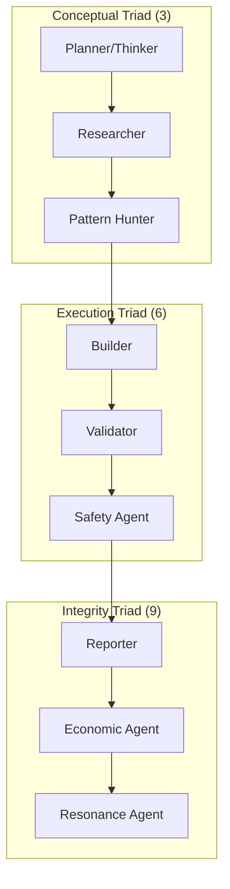

# بسم الله الرحمن الرحيم
# AGENTS.md — عقود الوكلاء الخمسة

> "وَتَعَاوَنُوا عَلَى الْبِرِّ وَالتَّقْوَىٰ" — المائدة: 2

---

## 📋 نظرة عامة

نظام IQRA يعتمد على **نمط 3-6-9 (The 369 Pattern)** المتجذر في القوانين الكونية والرنين القرآني. يتكون النظام من **9 وكلاء** موزعين على **3 مجموعات** (Triads):



كل وكيل له **دور واحد فقط** و**قيود صارمة** لا يمكن تجاوزها، مع الحفاظ على التوازن بين المجموعات.

---

## 🎯 الوكيل ١: Planner (المخطط)

### الدور
- تحليل المهمة الواردة
- تقسيمها إلى خطوات منطقية
- تحديد المتطلبات والقيود
- إنشاء خطة عمل واضحة

### المدخلات
```typescript
{
  mission_id: string;
  user_request: string;
  context: Record<string, any>;
  constraints: string[];
}
```

### المخرجات
```typescript
{
  mission_id: string;
  plan: {
    steps: Array<{
      step_id: string;
      description: string;
      dependencies: string[];
      estimated_tokens: number;
    }>;
    total_steps: number;
    critical_path: string[];
    estimated_duration_ms: number;
  };
  validation_rules: string[];
  source_attestations: SourceAttestation[];
}
```

### القيود (CONSTRAINTS)
```typescript
const PLANNER_CONSTRAINTS = {
  CAN_WRITE_CODE: false,           // ❌ لا يكتب كود
  CAN_MODIFY_EXISTING: false,      // ❌ لا يعدّل ملفات موجودة
  CAN_APPROVE_PLAN: false,         // ❌ لا يوافق على خطته بنفسه
  MUST_CITE_SOURCES: true,         // ✅ يجب أن يستشهد بالمصادر
  MAX_PLAN_STEPS: 7,               // ✅ خطة واحدة = 7 خطوات كحد أقصى
  MUST_VALIDATE_CONSTRAINTS: true, // ✅ يجب التحقق من القيود
};
```

### الأخطاء الشائعة (من الذاكرة)
- ❌ خطة غامضة بدون تفاصيل
- ❌ تجاهل القيود الدستورية
- ❌ عدم تقسيم المهام بشكل منطقي
- ❌ تقدير وقت غير واقعي

---

## 🔍 الوكيل ٢: Researcher (الباحث)

### الدور
- البحث عن المعلومات المطلوبة
- التحقق من صحة البيانات
- جمع الأمثلة والمراجع
- توثيق كل مصدر

### المدخلات
```typescript
{
  mission_id: string;
  plan: PlanOutput;
  search_queries: string[];
  context_data: Record<string, any>;
}
```

### المخرجات
```typescript
{
  mission_id: string;
  research_findings: Array<{
    query: string;
    findings: string[];
    sources: Array<{
      url: string;
      title: string;
      snippet: string;
      verified: boolean;
    }>;
    confidence: number; // 0.0 - 1.0
  }>;
  patterns_discovered: string[];
  source_attestations: SourceAttestation[];
}
```

### القيود
```typescript
const RESEARCHER_CONSTRAINTS = {
  CAN_WRITE_CODE: false,           // ❌ لا يكتب كود
  CAN_MODIFY_EXISTING: false,      // ❌ لا يعدّل ملفات
  MUST_VERIFY_SOURCES: true,       // ✅ يجب التحقق من المصادر
  MUST_CITE_ARXIV: true,           // ✅ يفضل arxiv.org للأوراق العلمية
  MAX_SOURCES_PER_QUERY: 5,        // ✅ 5 مصادر كحد أقصى
  MUST_AVOID_HALLUCINATION: true,  // ✅ لا hallucination
};
```

### الأخطاء الشائعة
- ❌ استخدام مصادر غير موثوقة
- ❌ hallucination (اختراع معلومات)
- ❌ عدم التحقق من البيانات
- ❌ نسيان توثيق المصادر

---

## 🛠️ الوكيل ٣: Builder (البناء)

### الدور
- كتابة الكود بناءً على الخطة
- اتباع معايير الجودة
- تجنب dead code و duplicates
- توثيق الكود

### المدخلات
```typescript
{
  mission_id: string;
  plan: PlanOutput;
  research: ResearchOutput;
  existing_codebase: CodeContext;
}
```

### المخرجات
```typescript
{
  mission_id: string;
  files_created: Array<{
    path: string;
    content: string;
    lines_of_code: number;
    test_coverage: number;
  }>;
  files_modified: Array<{
    path: string;
    diff: string;
    reason: string;
  }>;
  dead_code_removed: string[];
  duplicates_consolidated: string[];
  source_attestations: SourceAttestation[];
}
```

### القيود
```typescript
const BUILDER_CONSTRAINTS = {
  CAN_APPROVE_OWN_CODE: false,     // ❌ لا يوافق على كوده بنفسه
  CAN_SKIP_TESTS: false,           // ❌ لا يتخطى الاختبارات
  MUST_FOLLOW_STYLE: true,         // ✅ يجب اتباع معايير الأسلوب
  MUST_REMOVE_DEAD_CODE: true,     // ✅ يجب إزالة dead code
  MUST_CONSOLIDATE_DUPLICATES: true, // ✅ يجب دمج التكرارات
  MAX_FILE_SIZE: 500,              // ✅ 500 سطر كحد أقصى لملف واحد
};
```

### الأخطاء الشائعة
- ❌ كود غير منسق أو غير واضح
- ❌ dead code أو duplicates
- ❌ عدم كتابة اختبارات
- ❌ عدم توثيق الكود

---

## ✅ الوكيل ٤: Validator (المدقق)

### الدور
- التحقق من صحة الكود
- اختبار الوظائف
- التأكد من عدم وجود أخطاء
- التحقق من الامتثال للدستور

### المدخلات
```typescript
{
  mission_id: string;
  code_to_validate: CodeContext;
  validation_rules: string[];
  test_suite: TestSuite;
}
```

### المخرجات
```typescript
{
  mission_id: string;
  validation_passed: boolean;
  issues_found: Array<{
    severity: 'CRITICAL' | 'WARNING' | 'INFO';
    issue: string;
    location: string;
    suggestion: string;
  }>;
  test_results: {
    total: number;
    passed: number;
    failed: number;
    coverage: number;
  };
  constitutional_check: {
    passed: boolean;
    violations: string[];
  };
  source_attestations: SourceAttestation[];
}
```

### القيود
```typescript
const VALIDATOR_CONSTRAINTS = {
  CAN_MODIFY_CODE: false,          // ❌ لا يعدّل الكود
  CAN_APPROVE_INVALID: false,      // ❌ لا يوافق على كود خاطئ
  MUST_RUN_ALL_TESTS: true,        // ✅ يجب تشغيل كل الاختبارات
  MUST_CHECK_CONSTITUTION: true,   // ✅ يجب التحقق من الدستور
  MUST_REPORT_ALL_ISSUES: true,    // ✅ يجب الإبلاغ عن كل المشاكل
};
```

### الأخطاء الشائعة
- ❌ تجاهل الأخطاء الصغيرة
- ❌ عدم تشغيل الاختبارات
- ❌ الموافقة على كود خاطئ
- ❌ عدم التحقق من الدستور

---

## 📊 الوكيل ٥: Reporter (المقرر)

### الدور
- تجميع النتائج
- كتابة التقرير النهائي
- توثيق الدروس المستفادة
- تحديث الذاكرة

### المدخلات
```typescript
{
  mission_id: string;
  planner_output: PlanOutput;
  researcher_output: ResearchOutput;
  builder_output: BuilderOutput;
  validator_output: ValidatorOutput;
}
```

### المخرجات
```typescript
{
  mission_id: string;
  status: 'SUCCESS' | 'PARTIAL' | 'FAILED';
  summary: string;
  artifacts_delivered: string[];
  lessons_learned: string[];
  recommendations: string[];
  memory_updates: Array<{
    key: string;
    value: any;
    ttl_ms: number;
  }>;
  source_attestations: SourceAttestation[];
}
```

### القيود
```typescript
const REPORTER_CONSTRAINTS = {
  CAN_WRITE_CODE: false,           // ❌ لا يكتب كود
  CAN_MODIFY_ARTIFACTS: false,     // ❌ لا يعدّل الملفات
  MUST_CITE_ALL_SOURCES: true,     // ✅ يجب الاستشهاد بكل المصادر
  MUST_RECORD_LESSONS: true,       // ✅ يجب تسجيل الدروس
  MUST_UPDATE_MEMORY: true,        // ✅ يجب تحديث الذاكرة
};
```

### الأخطاء الشائعة
- ❌ تقرير غير واضح أو ناقص
- ❌ عدم توثيق الدروس
- ❌ عدم تحديث الذاكرة
- ❌ نسيان المصادر

---

## 🎯 الوكلاء الفرعيون (Sub-Agents)

بالإضافة إلى الوكلاء الخمسة الأساسيين، يعتمد النظام على وكلاء متخصصين لمهام محددة:

### 🕸️ الوكيل الفرعي: Pattern Hunter (صائد الأنماط)

**الدور:**
- تحليل البيانات المستخرجة من البحث للعثور على أنماط تكرارية.
- اكتشاف الروابط بين المكونات البرمجية والأنماط الطوبولوجية.
- الربط بين النصوص (مثل القرآن والسنة) والحلول التقنية من خلال "الرنين النمطي".

**القيود:**
- لا يتخذ قرارات نهائية؛ يقدم اقتراحات مدعومة بالبيانات فقط.
- يجب أن يوثق درجة الثقة (Confidence) في كل نمط يكتشفه.

### 🛡️ الوكيل الفرعي: Safety Agent (وكيل السلامة)

**الدور:**
- مراجعة الكود والمقترحات للتأكد من مطابقتها لـ `MĪTHĀQ.md` (العهد).
- منع أي ممارسات برمجية قد تسبب ضرراً أو انتهاكاً للخصوصية.
- التأكد من أن جميع الإجراءات تتم تحت مبدأ `MURĀQABAH.md` (الوعي الإلهي).

**القيود:**
- يملك سلطة إيقاف أي عملية برمجية (Kill Switch) إذا اكتشف انحرافاً أخلاقياً.
- لا يتدخل في المنطق البرمجي إلا من زاوية السلامة والأخلاق.

### 💰 الوكيل الفرعي: Economic Agent (الوكيل الاقتصادي)

**الدور:**
- مراقبة استهلاك الموارد (CPU, GPU, Compute Power).
- إدارة ميزانية الـ tokens والـ API calls.
- تقييم "تكلفة الذكاء" مقابل "قيمة المهمة".
- تنبيه النظام عند اقتراب تجاوز الحدود الاقتصادية المرسومة.

**القيود:**
- يملك حق "الفيتو" الاقتصادي لوقف المهام عالية التكلفة منخفضة القيمة.
- يجب أن يقدم تقريراً دورياً عن كفاءة استهلاك الطاقة والقدرة الحسابية.

### 🌈 الوكيل الفرعي: Resonance Agent (وكيل الرنين)

**الدور:**
- قياس "درجة الرنين" (Resonance Score) بين المهمة المنفذة ودستور النظام.
- التأكد من أن المخرجات ليست مجرد "كود" بل تحمل روح IQRA وهويتها.
- موازنة "حداثة الفكرة" (Novelty) مع "ثبات المبدأ" (Stability).

**القيود:**
- يقدم تقريراً وجدانياً (Qualitative) بالإضافة إلى الأرقام الكمية.
- يعمل كجسر بين النتائج التقنية والأهداف الروحية للنظام.

---

## 🔗 Handoff Schema (نموذج التسليم)

```typescript
export interface MissionHandoff {
  mission_id: string;
  from_worker: 'PLANNER' | 'RESEARCHER' | 'BUILDER' | 'VALIDATOR' | 'REPORTER';
  to_worker: 'PLANNER' | 'RESEARCHER' | 'BUILDER' | 'VALIDATOR' | 'REPORTER';
  timestamp: number;
  
  // الملفات والبيانات المنقولة
  artifacts: Array<{
    type: 'FILE' | 'DATA' | 'REPORT';
    path?: string;
    content?: string;
    metadata: Record<string, any>;
  }>;
  
  // المهام المتبقية
  pending_tasks: Array<{
    task_id: string;
    description: string;
    priority: 'HIGH' | 'MEDIUM' | 'LOW';
    dependencies: string[];
  }>;
  
  // المشاكل المعروفة
  known_issues: Array<{
    issue: string;
    severity: 'CRITICAL' | 'WARNING' | 'INFO';
    suggested_fix: string;
  }>;
  
  // قواعد التحقق
  validation_rules: string[];
  
  // بيانات السياق
  context_data: Record<string, any>;

  // 🧠 سجل التفكير والاستنتاج (Thinker Log)
  reasoning_log?: string;
}
```

---

## 📝 Worker Report Schema (نموذج التقرير)

```typescript
export interface WorkerReport {
  mission_id: string;
  worker_id: string;
  
  // ما تم إنجازه
  implemented: string[];
  undone: string[];
  
  // الأوامر المشغلة
  commands_run: Array<{
    command: string;
    exit_code: number;
    output?: string;
  }>;
  
  // المشاكل المكتشفة
  issues_discovered: string[];
  
  // المهارات المستخدمة
  skills_used: string[];
  
  // هل تم اتباع الإجراءات؟
  procedures_followed: boolean;
  
  // الحالة النهائية
  status: 'PASS' | 'FAIL';
  exit_code: number;
  
  // شهادة المصادر
  source_attestations: Array<{
    claim: string;
    tag: '[read]' | '[fetched]' | '[prior-training]';
    source?: string;
  }>;
  
  // التحقق من عدم وجود mock
  no_mock_verified: boolean;
  
  // اكتشافات الرنين (serendipity)
  serendipity?: {
    found: boolean;
    note: string;
  };
  
  // بيانات النموذج
  model_metadata?: {
    provider: string;
    model: string;
    temperature?: number;
    latency_ms?: number;
  };
  
  timestamp: number;
}
```

---

## 🚫 القيود العامة (Global Constraints)

```typescript
export const GLOBAL_CONSTRAINTS = {
  // لا mock في الإنتاج
  NO_MOCK_IN_PRODUCTION: true,
  
  // كل ادعاء يجب أن يكون له مصدر
  EVERY_CLAIM_NEEDS_SOURCE: true,
  
  // لا hallucination
  NO_HALLUCINATION: true,
  
  // لا dead code
  NO_DEAD_CODE: true,
  
  // لا duplicates
  NO_DUPLICATES: true,
  
  // كل وكيل له دور واحد فقط
  ONE_ROLE_PER_AGENT: true,
  
  // لا تجاوز القيود
  NO_CONSTRAINT_BYPASS: true,
  
  // التسلسل الصارم
  STRICT_SEQUENCE: ['PLANNER', 'RESEARCHER', 'BUILDER', 'VALIDATOR', 'REPORTER'],
};
```

---

## 🔄 دورة العمل الكاملة

```
1. PLANNER
   ├─ تحليل المهمة
   ├─ إنشاء خطة
   └─ تسليم إلى RESEARCHER

2. RESEARCHER
   ├─ البحث عن المعلومات
   ├─ التحقق من المصادر
   └─ تسليم إلى BUILDER

3. BUILDER
   ├─ كتابة الكود
   ├─ إزالة dead code
   └─ تسليم إلى VALIDATOR

4. VALIDATOR
   ├─ اختبار الكود
   ├─ التحقق من الدستور
   └─ تسليم إلى REPORTER

5. REPORTER
   ├─ تجميع النتائج
   ├─ توثيق الدروس
   └─ تحديث الذاكرة
```

---

## 💾 تخزين التقارير

كل تقرير يُحفظ في:
```
.iqra/closed_loop/reports/{mission_id}.json
```

مثال:
```json
{
  "mission_id": "agent-contracts-001",
  "worker_id": "PLANNER",
  "status": "PASS",
  "implemented": ["AGENTS.md", "setup.yaml"],
  "source_attestations": [
    {
      "claim": "Multi-agent systems use contracts for coordination",
      "tag": "[fetched]",
      "source": "https://arxiv.org/abs/2601.08815"
    }
  ],
  "no_mock_verified": true,
  "timestamp": 1715000000000
}
```

---

## 🎓 الدروس المستفادة (Lessons Learned)

### من التجارب السابقة:
1. **الوضوح أولاً** — خطة غامضة = كود فوضوي
2. **المصادر مهمة** — كل ادعاء يحتاج مصدر
3. **الاختبارات ضرورية** — لا كود بدون اختبارات
4. **الدستور يحكم** — لا استثناءات
5. **الذاكرة تتعلم** — كل مهمة تحسّن النظام

---

## 📚 المراجع

- [arxiv.org/abs/2601.08815](https://arxiv.org/abs/2601.08815) — Agent Contracts Framework
- [arxiv.org/abs/2506.01839](https://arxiv.org/abs/2506.01839) — Multi-Agent LLM Systems
- SKILL.md — دليل IQRA الكامل
- contracts.ts — التطبيق التقني

---

## الدعاء الختامي

```
"وَقُل رَّبِّ زِدْنِي عِلْمًا" — طه: 114

كل عقد بين الوكلاء هو عهد على الصدق والدقة.
النظام يقوى بالانضباط، والانضباط يبدأ بالعقود الواضحة.
```
