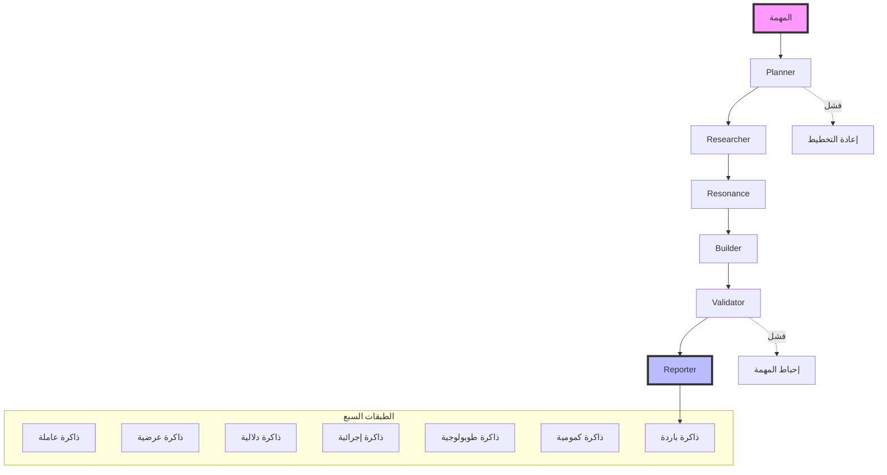
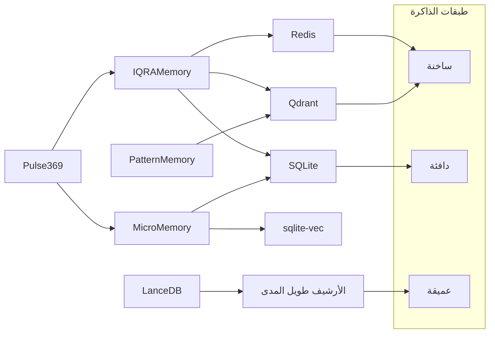

# شجرة البنية الكاملة لنظام IQRA
## بسم الله، والصلاة والسلام على رسول الله

**المرجع:** الدستور الأعلى `!IQRA_SUPREME.md`
**التاريخ:** 2026-05-10
**الحالة:** 285 خطأ TypeScript (الهدف: 250)

---

## 🏛️ البنية المعمارية الشاملة

### الطبقة 1: النواة الدستورية (Constitutional Kernel)
```
iqra-core/
├── DASTŪR.md          # القيود الصارمة (HARAM_LIST)
├── MĪTHĀQ.md          # العهد (The Covenant)
├── MURĀQABAH.md       # المراقبة (Surveillance)
├── ḤISĀB.md           # المحاسبة (Accounting)
├── TAWBAH.md          # التوبة (Repentance)
├── FITRAH.md          # الفطرة (Innate Nature)
├── run_iqra.ts        # نقطة الدخول الرئيسية
├── data/              # قواعد البيانات الحقيقية
│   ├── quran_local.db
│   ├── reward_ledger.jsonl
│   └── path_registry.json
├── identity/          # الهوية السيادية
├── quran/             # القرآن الكريم
├── science/           # العلم والبحث
├── skills/            # المهارات
└── voice/             # الصوت والنطق
```

### الطبقة 2: المكتبة التنفيذية (Execution Engine)
```
lib/iqra/
├── 01-core/           # النواة الأساسية
│   ├── brain.ts              # العقل المركزي
│   ├── core.ts               # الوكيل الأساسي
│   ├── sovereign.ts          # السيادة
│   ├── sovereign_orchestrator.ts # المنسق السيادي
│   ├── mission-context.ts    # سياق المهمة
│   ├── shura.ts              # الشورى
│   ├── constants.ts          # الثوابت
│   ├── tawbah.ts             # التوبة
│   ├── router/               # التوجيه
│   │   └── task_classifier.ts
│   └── conscience/           # الضمير
│       └── resource_factory.ts
├── 02-workers/         # العمال المنفذين
│   ├── protocol.ts           # بروتوكول التواصل
│   ├── resonance.ts          # عامل الرنين
│   ├── research.ts           # عامل البحث
│   ├── validator.ts          # عامل التحقق
│   ├── builder.ts            # عامل البناء
│   ├── planner.ts            # عامل التخطيط
│   ├── execution.ts          # عامل التنفيذ
│   ├── reporter.ts           # عامل التقرير
│   ├── mission_validator.ts  # التحقق من المهمة
│   ├── worker_conscience.ts  # ضمير العامل
│   └── trading_agent.ts      # وكيل التداول
├── 03-memory/          # الذاكرة (الطبقات السبع)
│   ├── memory.ts             # الذاكرة العامة
│   ├── micro_memory.ts       # الذاكرة الدقيقة
│   ├── pattern_memory.ts     # الذاكرة الأنماط
│   ├── memory_bridge.ts      # جسر الذاكرة
│   ├── pulse_369.ts          # نبض 369
│   ├── lancedb_plugin.ts     # إضافة LanceDB
│   └── turbo_compressor.ts   # الضغط التيربو
├── 04-quran/           # القرآن والرنين
│   ├── go_engine_client.ts   # عميل محرك Go
│   ├── go_engine_proximity.ts # واجهة القرب
│   ├── pattern_hunter.ts     # صائد الأنماط
│   ├── surah_analyzer.ts     # محلل السور
│   ├── discovery_loop.ts     # حلقة الاكتشاف
│   └── numerical_validator.ts # التحقق العددي
├── 05-rewards/         # نظام المكافآت
│   ├── engine.ts             # محرك المكافآت
│   ├── ledger.ts             # سجل المكافآت
│   └── types.ts              # أنواع المكافآت
├── 06-security/        # الأمن والسيادة
│   ├── security.ts           # الأمن العام
│   ├── damir_conscience.ts   # ضمير دمير
│   ├── sovereign_identity.ts # الهوية السيادية
│   ├── did.ts                # الهوية اللامركزية
│   ├── filter.ts             # الفلترة
│   ├── byzantine_filter.ts   # فلترة البيزنطية
│   └── audit/                # التدقيق
├── 07-llm/             # نماذج اللغة
│   ├── ollama.ts             # Ollama المحلي
│   ├── groq.ts               # Groq API
│   ├── gemini.ts             # Gemini API
│   └── model_orchestrator.ts # منسق النماذج
├── 08-skills/          # المهارات
│   ├── skill_bank.ts         # بنك المهارات
│   ├── git_skill.ts          # مهارة Git
│   ├── pi_network.ts         # شبكة Pi
│   └── topological_analyzer.ts # المحلل الطوبولوجي
├── 09-evolution/       # التطور
│   ├── experience_buffer.ts  # مخزن الخبرات
│   ├── search_369.ts         # البحث 369
│   ├── league_manager.ts     # مدير الدوريات
│   └── memory_decay.ts       # تدهور الذاكرة
├── 10-topology/       # الطوبولوجيا
│   ├── persistent_homology.ts # التماثل المستمر
│   └── topological_curiosity.ts # الفضول الطوبولوجي
├── 11-trading/         # التداول
│   ├── bybit_client.ts       # عميل Bybit
│   ├── market_data.ts        # بيانات السوق
│   ├── self_play_loop.ts     # حلقة التلعب الذاتي
│   └── trading_agent.ts      # وكيل التداول
├── 12-infrastructure/ # البنية التحتية
│   ├── logger.ts             # المسجل
│   ├── heartbeat.ts          # نبض النظام
│   ├── tools_registry.ts     # سجل الأدوات
│   └── telegram_bot.ts       # بوت تيليجرام
└── 13-utils/           # الأدوات المساعدة
    ├── prompts.ts            # الأوامر المضمنة
    ├── personality.ts        # الشخصية
    ├── style.ts              # الأسلوب
    ├── timeout.ts            # المهلات
    └── storyteller.ts        # الراوي
```

### الطبقة 3: الاختبارات (Tests)
```
tests/
├── unit/              # اختبارات الوحدة
│   ├── micro_memory.test.ts
│   ├── pulse_369.test.ts
│   ├── damir_conscience.test.ts
│   ├── reward-engine.test.ts
│   └── ...
└── e2e/               # اختبارات النهاية للنهاية
    ├── pattern_hunter.e2e.ts
    ├── resonance_cycle.test.ts
    ├── full_mission_loop.e2e.ts
    └── ...
```

### الطبقة 4: السكربتات والخدمات
```
scripts/              # السكربتات
├── topological_resonance_hunter.ts
├── interact.ts
├── auto_improve.ts
└── ...

services/             # الخدمات
├── telegram/          # خدمة تيليجرام
└── ...                # خدمات أخرى
```

---

## 🧬 المخططات المرئية (Mermaid Diagrams)

### مخطط تدفق العمال (Agent Handoff Flow)


### مخطط الذاكرة الموزعة


---

## 🔗 روابط الملفات المباشرة

- **الدستور الأعلى:** `/Applications/iqra/!IQRA_SUPREME.md`
- **النواة الأساسية:** `/Applications/iqra/lib/iqra/01-core/brain.ts`
- **المنسق السيادي:** `/Applications/iqra/lib/iqra/01-core/sovereign_orchestrator.ts`
- **بروتوكول العمال:** `/Applications/iqra/lib/iqra/02-workers/protocol.ts`
- **محرك Go:** `/Applications/iqra/lib/iqra/04-quran/go_engine_client.ts`
- **الذاكرة الدقيقة:** `/Applications/iqra/lib/iqra/03-memory/micro_memory.ts`
- **نظام المكافآت:** `/Applications/iqra/lib/iqra/05-rewards/engine.ts`
- **النبض:** `/Applications/iqra/lib/iqra/12-infrastructure/heartbeat.ts`

---

## 📊 حالة البحث الحالية

- **أخطاء TypeScript:** 285 (الهدف: 250)
- **الملفات المثبتة:** 29
- **المسارات المصلحة:** 45+
- **النمط المستفاد:** تلوث المسارات النسبية في الملفات التجريبية
