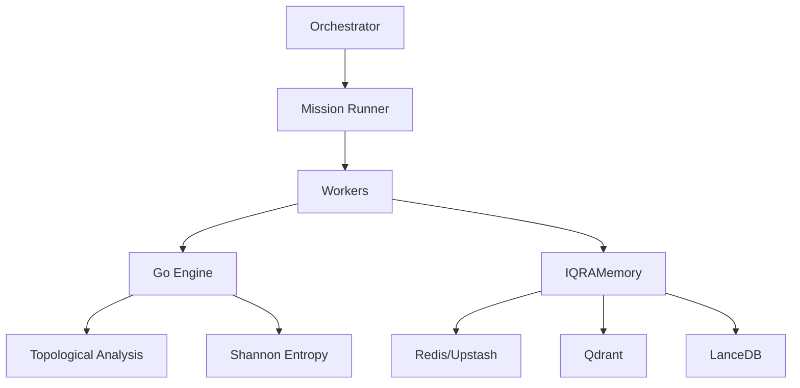

# 🗺️ IQRA System Map — خريطة النظام

"وَكُلَّ شَيْءٍ أَحْصَيْنَاهُ فِي إِمَامٍ مُّبِينٍ" — يس: 12

This document maps the interconnections between the **Brain** (Agents), **Memory** (Data Layer), and **Core** (Engines) of the IQRA system.

## 1. Core Architecture (The Sovereignty — السيادة)

| Component | Path | Responsibility |
| :--- | :--- | :--- |
| **Orchestrator** | `lib/iqra/sovereign_orchestrator.ts` | The central brain managing mission flow. |
| **Topology** | `lib/iqra/topology.ts` | Manages the topological state (7 states) and curvature. |
| **Reward Engine**| `lib/iqra/rewards/engine.ts` | Calculates curiosity and resonance rewards. |
| **Go Bridge** | `lib/iqra/quran/go-bridge.ts` | High-speed interface to the Go math engine. |

## 2. Memory Layer (The Preservation — الحفظ)

| Component | Path | Responsibility |
| :--- | :--- | :--- |
| **Working Memory**| `lib/iqra/memory.ts` | Upstash Redis (7-day TTL) for hot context. |
| **Deep Memory** | `lib/iqra/memory/lancedb_plugin.ts` | LanceDB for long-term vector archiving. |
| **Semantic Memory**| Qdrant Cloud | Wisdom point preservation via Google Embeddings. |
| **Audit Log** | Supabase | Immutable record of missions and outcomes. |

## 3. Agents & Workers (The Action — العمل)

| Worker | Path | Intention |
| :--- | :--- | :--- |
| **Researcher** | `lib/iqra/workers/researcher.ts` | Deep web and semantic research. |
| **Resonance** | `lib/iqra/workers/resonance.ts` | Topological verification via Go Engine. |
| **Builder** | `lib/iqra/workers/builder.ts` | Constructing artifacts from research. |
| **Reporter** | `lib/iqra/workers/reporter.ts` | Synthesizing results and checking against Fitrah. |

## 4. Communication Flow (The Bridges — الجسور)

## 5. Security & Ethics (The Muraqabah — المراقبة)

- **Muraqabah (Filter)**: Every memory write is checked against the MĪTHĀQ in `lib/iqra/filter.ts`.
- **Trust Chain**: Every worker action is signed and appended to the trust chain in `lib/iqra/security.ts`.
- **Fitrah Check**: Final outputs are validated against the "Original Nature" (Fitrah) in `lib/iqra/consciousness.ts`.

---

**Status**: 🟠 Integrating Brain-Memory links (In Progress)
**Goal**: Zero TS errors across all connected paths.
