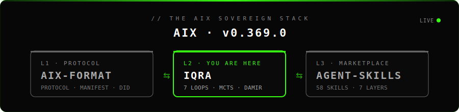
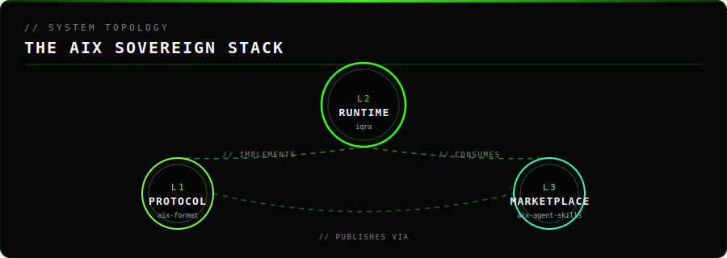
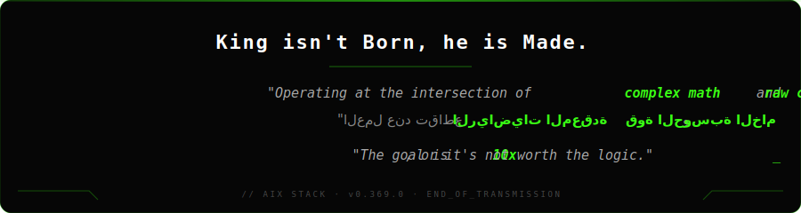

<!-- ════════════════ AIX SOVEREIGN STACK · UNIFIED BRANDING ════════════════ -->

<div align="center">
  
</div>

<div align="center">

[](https://github.com/Moeabdelaziz007/iqra)
[](https://github.com/Moeabdelaziz007/aix-format)
[](./LICENSE)

</div>

<div align="center">

[**← L1 · PROTOCOL · `aix-format`**](https://github.com/Moeabdelaziz007/aix-format) &nbsp;·&nbsp; **🟢 L2 · RUNTIME · `iqra` · YOU ARE HERE** &nbsp;·&nbsp; [**L3 · MARKETPLACE · `aix-agent-skills` →**](https://github.com/Moeabdelaziz007/aix-agent-skills)

</div>

<br/>

<!-- ════════════════ /AIX SOVEREIGN STACK ════════════════ -->

<div align="center">
<br/>


# IQRA 🤍
### The First Sovereign AI Operating System
<p><i>Building Intelligence that Obeys the Creator, then the User.</i></p>

<p>
  
  
  
</p>

<br/>
</div>

---

## 🌀 The 7 Sovereign Loops (الدوائر السبع السيادية)

IQRA operates through seven recursive layers of intelligence, ensuring every action is aligned with the **Supreme Constitution**:

1.  **Read & Map (الفهم والخرائط)**: Deep contextual ingestion of the user's intent.
2.  **Evaluate (التقييم)**: Static and dynamic ethical filtering via the **Damir Conscience**.
3.  **Plan (التخطيط)**: MCTS-powered strategic simulation of the best path.
4.  **Verify (التحقق)**: Strict validation of every step before final execution.
5.  **Prioritize (الأولويات)**: Dynamic resource allocation based on topological resonance.
6.  **Fix (الإصلاح الذاتي)**: The **Tawbah Loop** for autonomous error correction.
7.  **Evolve (التطور العضوي)**: Compounding knowledge through the **Pristine Reward Engine**.

---

## 🌐 THE STACK | المنظومة المتكاملة

IQRA is **L2** of the AIX Sovereign Stack — the runtime engine that executes the [`aix-format`](https://github.com/Moeabdelaziz007/aix-format) protocol and consumes skills from the [`aix-agent-skills`](https://github.com/Moeabdelaziz007/aix-agent-skills) marketplace.

<div align="center">
  
</div>

| Layer | Repo | Role | Status |
|:---:|:---|:---|:---:|
| ⚪ **L1** | [`aix-format`](https://github.com/Moeabdelaziz007/aix-format) | **Protocol** · Universal Agent Passport · DID · Manifest · ABOM · TrustChain | [→ Read](https://github.com/Moeabdelaziz007/aix-format) |
| 🟢 **L2** | [`iqra`](https://github.com/Moeabdelaziz007/iqra) | **Runtime** · Sovereign AI OS · 7 Loops · MCTS · Damir · MissionControl | **You are here** |
| ⚪ **L3** | [`aix-agent-skills`](https://github.com/Moeabdelaziz007/aix-agent-skills) | **Marketplace** · 7 Layers · Constitutional · TrustChain | [→ Read](https://github.com/Moeabdelaziz007/aix-agent-skills) |

> The three repositories are **one project in three layers**. The protocol is the contract, the runtime is the engine, the marketplace is the catalog. Same constitution, same TrustChain, same palette, same author.

---

## 📚 Documentation (وثائق شاملة)

### 🏗️ Architecture & Design (معمارية النظام)
- **[📜 الدستور — DASTŪR.md](./src/lib/iqra/00-manifest/DASTŪR.md)** — القواعد الحاكمة والأساسات
- **[⚖️ الميثاق — MĪTHĀQ.md](./src/lib/iqra/00-manifest/MĪTHĀQ.md)** — بروتوكولات الثقة والتعاون
- **[🧩 الشورى — SHŪRĀ.md](./src/lib/iqra/00-manifest/SHŪRĀ.md)** — آلية اتخاذ القرار بين الوكلاء
- **[🌀 التطور — METAMORPHOSIS.md](./src/lib/iqra/00-manifest/METAMORPHOSIS.md)** — قوانين التطور الذاتي والتعلم
- **[🛠️ سوق المهارات — Skills Marketplace](https://github.com/Moeabdelaziz007/aix-agent-skills)** — مستودع المهارات اللامركزي (للوكلاء والبشر)

### 🔧 Technical Reference
- **[docs/TOOLS_REFERENCE.md](./docs/TOOLS_REFERENCE.md)** — مرجع الأدوات والقدرات
- **[CLEANUP_PROGRESS_SUMMARY.md](./CLEANUP_PROGRESS_SUMMARY.md)** — تقدم تنظيف الكود

### 📊 Analysis & Reports
- **[DEAD_CODE_ANALYSIS.md](./DEAD_CODE_ANALYSIS.md)** — تحليل الملفات الميتة
- **[IMPORT_FIXES_NEEDED.md](./IMPORT_FIXES_NEEDED.md)** — قائمة الاستيرادات المطلوبة

---

## ✦ What is IQRA?

IQRA is a **multi-agent AI operating system** that runs missions, learns from every cycle, and enforces ethical constraints at the engine level — not as an afterthought.

> Every action is logged. Every intent is checked. Every discovery is rewarded.

```
User Input
    │
    ▼
┌─────────────────────────────────────────────────────────┐
│                    brain.ts  🧠                          │
│         Integrity Filter  ·  Skill Router               │
└────────────────────┬────────────────────────────────────┘
                     │
                     ▼
┌─────────────────────────────────────────────────────────┐
│              MissionControl  🛰️                          │
│   Search369  ·  LeagueManager  ·  TopologicalAnalyzer   │
└────────────────────┬────────────────────────────────────┘
                     │
          ┌──────────▼──────────┐
          │    Worker Chain     │
          │                     │
          │  Resonance Worker   │
          │       ↓             │
          │  Research Worker    │
          │       ↓             │
          │  Validation Worker  │
          │       ↓             │
          │  Execution Worker   │
          └──────────┬──────────┘
                     │
                     ▼
          RewardEngine  ·  MicroMemory  ·  TrustChain  ·  MCTS Simulation
```

---

## ✦ Core Features

<table>
<tr>
<td width="50%">

### 🤖 Multi-Agent Orchestration
Sequential worker chain with strict handoff contracts.
Each agent has a defined role — no overlap, no self-approval.

`Planner → Researcher → Builder → Validator → Reporter`

</td>
<td width="50%">

### 🔐 Ethics Engine (Damir)
Built on **Graded Linear Logic** — every action consumes real resources exactly once.

- Intent checked before execution
- No hallucination, no deception
- Immutable SHA-256 TrustChain log

</td>
</tr>
<tr>
<td width="50%">

### 🧠 5-Layer Memory (MemoryBridge)

| Layer | Store | TTL | Role |
|-------|-------|-----|------|
| **Hot** | RAM (Map) | 1h | Ultra-fast context (7x7) |
| **Warm** | SQLite | 7d | Micro-memories & Patterns |
| **Cold** | Redis/JSON | 30d | Cognitive history |
| **Vector** | Qdrant | ∞ | Semantic Resonance |
| **Archive** | LanceDB | ∞ | Long-term Knowledge |

</td>
<td width="50%">

### 🌀 Self-Evolution & MCTS
The system learns via **Self-Play Simulations**:

- **MCTS Engine**: Monte Carlo Tree Search for strategic data generation.
- **Skills Marketplace**: Decentralized Markdown-based skills in [`aix-agent-skills`](https://github.com/Moeabdelaziz007/aix-agent-skills).
- **Meta-Evolution**: Auto-rewriting skills via local LLM (qwen2.5).

</td>
</tr>
<tr>
<td width="50%">

### 📖 Quran Pattern Engine
Computational linguistics on Arabic sacred text.

- Shannon entropy (H_EL < 0.9685 bit = Quran signature)
- Topological resonance scoring
- Persistent homology H0 / H1
- Local SQLite DB — works offline

</td>
<td width="50%">

### 🏆 Reward Engine
Every mission produces a scored entry:

```
reward = (novelty + resonance + topology
          - penalty) × path_multiplier

pristine path → 2.0×
repeated path → 0.8×
stale path    → 0.5×
```

`seed → sprout → branch → tree → resonance → revelation`

</td>
</tr>
</table>

---

## ✦ Quick Start

```bash
# 1. Clone & install
git clone https://github.com/Moeabdelaziz007/iqra.git
cd iqra && npm install

# 2. Environment
cp .env.example .env
# Required: GROQ_API_KEY, GOOGLE_GENERATIVE_AI_API_KEY
# Optional: UPSTASH_REDIS_REST_URL, QDRANT_URL

# 3. Local mode — 8GB RAM friendly
ollama pull gemma3:4b
IQRA_LLM_LOCAL=true npm run dev

# 4. Run tests
npx vitest run tests/unit/
```

> **Mac Intel 8GB?** Use `gemma3:4b` (~3GB RAM). The system auto-detects and selects it.

---

## ✦ Vercel Frontend Deployment (Next.js)

### 1) Build validation (local first)

```bash
npm run build
```

### 2) Required environment variables on Vercel

- `NEXT_PUBLIC_APP_URL` (e.g. `https://your-domain.com`)
- `NEXT_PUBLIC_APP_DOMAIN` (e.g. `your-domain.com`)
- `PI_VALIDATION_KEY` (for Pi Browser domain claim)
- `GROQ_API_KEY`
- `GOOGLE_GENERATIVE_AI_API_KEY`
- `UPSTASH_REDIS_REST_URL` (if memory cloud is enabled)
- `UPSTASH_REDIS_REST_TOKEN`

### 3) Deploy

```bash
npx vercel
# then
npx vercel --prod
```

### 4) Post-deploy checks

- `/.well-known/did.json`
- `/.well-known/agent-card.json`
- `/.well-known/pi-network/validation-key.txt`
- `/validation-key.txt`
- `/api/iqra/query`
- `/api/iqra/topology/hidden`

---

## ✦ A2A + DID + Pi Domain Claim

### A2A discovery endpoints

- `/.well-known/agent-card.json` — agent capabilities + methods
- `/.well-known/did.json` — `did:web` document for sovereign identity

### Pi Browser domain claim

Set `PI_VALIDATION_KEY` on Vercel, then verify:

```bash
curl https://your-domain.com/.well-known/pi-network/validation-key.txt
curl https://your-domain.com/validation-key.txt
```

If both return the same key, domain claim is ready on Pi Developer Portal.

### Hidden topology capture API (browser-driven)

Use this endpoint from network-visualization frontends to detect obscured topology layers, extract hidden connection patterns, and export results in standard formats:

```bash
curl -X POST https://your-domain.com/api/iqra/topology/hidden \
  -H "content-type: application/json" \
  -d '{
    "layers":[{"id":"L1","name":"core","visible":true},{"id":"L2","name":"overlay","visible":false}],
    "nodes":[{"id":"n1","layerId":"L1"},{"id":"n2","layerId":"L2"}],
    "edges":[{"source":"n1","target":"n2"}],
    "exportFormat":"json"
  }'
```

Supported exports: `json`, `csv`, `graphml`.

---

## ✦ LLM Providers

| Mode | Provider | Model | RAM |
|------|----------|-------|-----|
| 🏠 Local | Ollama | `gemma3:4b` | ~3GB |
| ⚡ Fast | Groq | `llama-3.3-70b` | Cloud |
| 🔬 Deep | Google AI | `gemini-2.0-flash` | Cloud |

The system falls back gracefully: `Local → Groq → Gemini`

---

## ✦ Project Structure

```
iqra/
├── src/lib/iqra/             # Core Sovereign Engine
│   ├── 00-manifest/          # Constitution & Protocols
│   ├── 01-core/              # Orchestration & Brain
│   ├── 02-workers/           # Agent Worker Chain
│   ├── 03-memory/            # 5-layer Memory Bridge
│   ├── 08-skills/            # Dynamic Skill Loader (loads from external repo)
│   ├── simulation/           # MCTS Self-play Engine
│   └── rewards/              # Reward Engine + Ledger
│
├── aix-agent-skills/         # 🆕 Decentralized Skills Marketplace (separate repo)
│   ├── skills/               # Markdown-based skill definitions
│   ├── skills.json           # Skill registry & metadata
│   └── antigravity-jules.md  # Shared AI Agent Task Board
│
├── iqra-core/                # State, Identity, & Knowledge
│   ├── identity/             # Sovereign DID & Cards
│   └── skills/               # Legacy Skill Docs (Markdown)
│
├── tests/                    # Unit, Integration, E2E
└── src/app/                  # Next.js UI Dashboard
```

---

## ✦ Security Layers

```
┌─────────────────────────────────────────────┐
│  1. Integrity Filter     static + dynamic   │
│  2. Covenant Check       constitution guard │
│  3. Damir (Ethics Engine) linear logic      │
│  4. TrustChain           SHA-256 audit log  │
│  5. Circuit Breaker      per-provider       │
│  6. Shura Protocol       human approval     │
│  7. Self-Correction      auto rollback      │
│  8. Memory Purification  every 40 cycles    │
│  9. Human Escalation     after 9 failures   │
└─────────────────────────────────────────────┘
```

---

<!-- IQRA-LATEST-START -->
### آخر ما تعلمت | Latest Learning

> *تحديث تلقائي مع كل خطوة في الرحلة*
> *Auto-updated with every step of the journey*

| | |
|---|---|
| 📅 **التاريخ \| Date** | `2026-05-12` |
| 💡 **آخر خطوة \| Last Step** | IQRA Sovereign Runtime: Stabilization and Structural Unification |
| 🔗 **الـ Commit** | `8317a4c` |

<!-- IQRA-LATEST-END -->

---

<div align="center">

<br/>

**IQRA** — Built for truth. Engineered for accountability. 🤍

<br/>


<br/><br/>

</div>

---

<!-- ════════════════ AIX SOVEREIGN STACK · FOOTER ════════════════ -->

<div align="center">

[**← L1 · PROTOCOL · `aix-format`**](https://github.com/Moeabdelaziz007/aix-format) &nbsp;·&nbsp; **🟢 L2 · RUNTIME · `iqra` · YOU ARE HERE** &nbsp;·&nbsp; [**L3 · MARKETPLACE · `aix-agent-skills` →**](https://github.com/Moeabdelaziz007/aix-agent-skills)

</div>

<div align="center">
  
</div>

<!-- ════════════════ /AIX SOVEREIGN STACK · FOOTER ════════════════ -->

